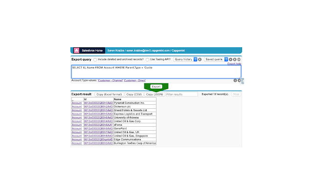

# Salesforce Starter Pack - Main tools for Developers in the SFDC platform, including useful VSC and Chrome extensions.

<p align="center">
    
</p>


## Table of Contents  
- [Basic applications](#basic-applications)  
    - [Node.js](#node.js)
    - [Java SE Development Kit](#java-se-development-kit-jdk-11.0-version-(or-java-8.0))
    - [Visual Studio Code](#visual-studio-code)
        - [VSC configuration](#visual-studio-code-configuration)
    - [GIT](#git)
        - [GIT configuration](#git-configuration)
    - [Salesforce CLI](#salesforce-cli)
    - [Uncrustify](#uncrustify)

- [VSC Salesforce Extensions](#vsc-salesforce-extensions)
    - [Salesforce Extension Pack Configuration](#salesforce-extensions-configuration)
- [GIT Graph](#git-graph)
- [GIT Lens](#git-lens)
- [ESLint](#eslint)
- [Prettier](#prettier)
- [Uncrustify](#uncrustify)
- [#region folding for VS Code](#region-folding-for-vs-code)
- [XML Language Support](#xml-language-support)
- [Salesforce Documenter](#salesforce-documenter)

- [Chrome Salesforce Extensions](#chrome-salesforce-extensions)
    - [Salesforce Inspector](#salesforce-inspector)

## Basic applications

### Node.js

> Download Link:- https://nodejs.org/es/

Node.js is a server-side platform built on Google Chrome's JavaScript Engine (V8 Engine) for easily building fast and scalable network applications. Most of tools are executed using this runtime (in our case Visual Studio Code and Salesforce CLI). Node uses a package manager call NPM (Node Package Manager) to provide fast delivery packages.

### Java SE Development Kit (JDK) 11.0 version (or Java 8.0)

> Download Link:- https://www.oracle.com/es/java/technologies/javase/jdk11-archive-downloads.html

The Java Development Kit (JDK) is one of three core technology packages used in Java programming, along with the JVM (Java Virtual Machine) and the JRE (Java Runtime Environment). It's important to differentiate between these three technologies, as well as understanding how they're connected:

The JVM is the Java platform component that executes programs.
The JRE is the on-disk part of Java that creates the JVM.
The JDK allows developers to create Java programs that can be executed and run by the JVM and JRE.
Developers new to Java often confuse the Java Development Kit and the Java Runtime Environment. The distinction is that the JDK is a package of tools for developing Java-based software, whereas the JRE is a package of tools for running Java code.

The JRE can be used as a standalone component to simply run Java programs, but it's also part of the JDK. The JDK requires a JRE because running Java programs is part of developing them.

### Visual Studio Code (VSC)

> Download Link:- https://code.visualstudio.com/

Visual Studio Code combines the simplicity of a source code editor with powerful developer tooling, like IntelliSense code completion and debugging.

First and foremost, it is an editor that gets out of your way. The delightfully frictionless edit-build-debug cycle means less time fiddling with your environment, and more time executing on your ideas.

Visual Studio Code supports macOS, Linux, and Windows - so you can hit the ground running, no matter the platform.

Customize every feature to your liking and install any number of third-party extensions. While most scenarios work "out of the box" with no configuration, VS Code also grows with you, and we encourage you to optimize your experience to suit your unique needs. VS Code is an open-source project so you can also contribute to the growing and vibrant community on GitHub :octocat:


#### Visual Studio Code Configuration

To access Visual Studio Code configuration file you can edit the .json file directly or use the UI (this is the easiest one). Go to:

```bash
File > Preferences > Settings
```

Keep the default values, except for the following points:
| Extension | Configuration | Value |
| :----: | :---: | :---: |
| Text editor | Render Whitespace | X |
| Diff tool | Ignore Trim Whitespace | |
| Breadcrumbs | Enabled | X |
| Git | autofetch | |
| Git | Enable Smart Commit | X |
| Git | Fetch On Pull | |
| Git | Rebase When Sync | |
| Git | Show Push Success Notification | X |
| npm | Npm: Enable Scrip[t Explorer| X |
| npm | Npm: Script Explorer Action | run |

### Git

> Download Link:- https://git-scm.com/

Git is the most commonly used version control system. Git tracks the changes you make to files, so you have a record of what has been done, and you can revert to specific versions should you ever need to. Git also makes collaboration easier, allowing changes by multiple people to all be merged into one source. 

So regardless of whether you write code that only you will see, or work as part of a team, Git will be useful for you.

Git is software that runs locally. Your files and their history are stored on your computer. You can also use online hosts (such as GitHub :octocat: or Bitbucket) to store a copy of the files and their revision history. Having a centrally located place where you can upload your changes and download changes from others, enable you to collaborate more easily with other developers. Git can automatically merge the changes, so two people can even work on different parts of the same file and later merge those changes without losing each other’s work!

Along GIT installation the following components need to be selected:
 - Windows Explorer Integration
 - Git LFS (Large File Support)
 - Associate .git* configuration files with the default text editor
 - Associate .sh* to be run with Bash

And the following options need to be marked:
 - User Visual Studio Code as Git’s default editor
 - Git from the command line and also from 3rd-party software
 - Use the OpenSSL Library
 - Checkout Windows-style, commit Unix-style line endings

#### GIT Configuration
And after finishing the installation, the next commands need to be executed on the Windows CMD to set the credentials:

```cmd
git config --global user.name "USERNAME" 
git config --global user.email "USER_EMAIL" 
git config --global diff.algorithm patience 
```

Where:
- USERNAME: name displayed on the commits.
- USER_EMAIL: email to associate to the USERNAME.
- patience: algorithm used to compare files.


### Salesforce CLI

> Download Link:- https://developer.salesforce.com/tools/sfdxcli 

The Salesforce CLI is a powerful command line interface that simplifies development and build automation when working with your Salesforce org. Use it to:

- Aggregate all the tools you need to develop with and perform commands against your Salesforce org
- Synchronize source to and from scratch orgs
- Create and manage orgs
- Import and export data
- Create and execute tests
- Create and install packages

After you install Salesforce CLI, run the following command in a terminal or command shell to view the list of available commands.

```cmd
sfdx commands
```


### Uncrustify
A source code beautifier for C, C++, C#, ObjectiveC, D, Java, Pawn and VALA

Features:
- Highly configurable - 753 configurable options as of version 0.73.0
- add/remove spaces
- add/remove newlines
- add/remove blanklines
- indent code
- align code
- modify code

To install Uncrustify you need to use Chocolatey, a Package Manager for Windows.

> Download Link:- https://chocolatey.org/install#install-step1

And then execute this command line:

```Powershell
choco install uncrustify
```

After finishing the installation copy this [file](./resources/uncrustify.cfg) to the following directory.

```bash
C:\\Users\\USER_NAME
```

## VSC Salesforce Extensions
### Salesforce Extensions for Visual Studio Code

> Download Link:- https://marketplace.visualstudio.com/items?itemName=salesforce.salesforcedx-vscode

This extension pack includes tools for developing on the Salesforce platform in the lightweight, extensible VS Code editor. These tools provide features for working with development orgs (scratch orgs, sandboxes, and DE orgs), Apex, Aura components, and Visualforce.

<p align="center">
    
</p>

#### Salesforce Extensions Configuration
To access Visual Studio Code configuration file you can edit the .json file directly or use the UI (this is the easiest one). Go to:

```bash
File > Preferences > Settings
```

Keep the default values, except for the following points:
| Extension | Configuration | Value |
| :----: | :---: | :---: |
| Salesforce Apex Configuration | Enable-semantic-errors | X |
| Salesforce Apex Configuration | Enable-sobject-refresh-onstartup | X |
| Salesforce Apex Configuration | Java:Home | JAVA_HOME |
| Salesforce Feature Previews | Detect Conflicts At Sync | X |
| Salesforce Feature Previews | Push-or-deploy-on-save |  |
| Salesforce Feature Previews | Retrieve-test-code-coverage | X |
| Salesforce Lightning | Show Lightning Explorer | X |
| Salesforce Visualforce | Visualforce>Format:Indent Inner HTML | X |

### GIT Graph

> Download Link:- https://marketplace.visualstudio.com/items?itemName=mhutchie.git-graph

View a Git Graph of your repository, and easily perform Git actions from the graph. Configurable to look the way you want!

<p align="center">
    
</p>

#### GIT Graph Configuration
To access Visual Studio Code configuration file you can edit the .json file directly or use the UI (this is the easiest one). Go to:

```bash
File > Preferences > Settings
```

Keep the default values, except for the following points:
| Extension | Configuration | Value |
| :----: | :---: | :---: |
| Git Graph | Fetch Avatars | X |

### GIT Lens

> Download Link:- https://marketplace.visualstudio.com/items?itemName=eamodio.gitlens

GitLens simply helps you better understand code. Quickly glimpse into whom, why, and when a line or code block was changed. Jump back through history to gain further insights as to how and why the code evolved. Effortlessly explore the history and evolution of a codebase.

<p align="center">
    
</p>

### ESLint

> Download Link:- https://marketplace.visualstudio.com/items?itemName=dbaeumer.vscode-eslint

ESLint statically analyzes your code to quickly find problems. ESLint is built into most text editors and you can run ESLint as part of your continuous integration pipeline. Many problems ESLint finds can be automatically fixed. ESLint fixes are syntax-aware so you won't experience errors introduced by traditional find-and-replace algorithms.

### Prettier

> Download Link:- https://marketplace.visualstudio.com/items?itemName=esbenp.prettier-vscode

Prettier is an opinionated code formatter. It enforces a consistent style by parsing your code and re-printing it with its own rules that take the maximum line length into account, wrapping code when necessary.

### Uncrustify

> Download Link:- https://marketplace.visualstudio.com/items?itemName=zachflower.uncrustify

Formats your code using uncrustify. Supported languages are :

- C
- C++
- C#
- D
- Java
- Objective-C
- Pawn
- Vala

Apex, while not officially supported by uncrustify, is also partially supported by the extension and will be formatted as if it was Java.

#### Uncrustify Configuration
To access Visual Studio Code configuration file you can edit the .json file directly or use the UI (this is the easiest one). Go to:

```bash
File > Preferences > Settings
```

Keep the default values, except for the following points:
| Extension | Configuration | Value |
| :----: | :---: | :---: |
| Uncrustify Configuration | Config Path: Windows | [ Edit .json file, add next line ] C:\\Users\\USER_NAME\\uncrustify.cfg |
| Uncrustify Configuration | Use Replace Option | X |

### #region folding for VS Code

> Download Link:- https://marketplace.visualstudio.com/items?itemName=maptz.regionfolder

This extension enhances the default code folding abilities of Visual Studio Code editor. Regions of code that you'd like to be folded can be wrapped with #region comments.

<p align="center">
    
</p>

### XML Language Support

> Download Link:- https://marketplace.visualstudio.com/items?itemName=redhat.vscode-xml

This VS Code extension provides support for creating and editing XML documents, based on the LemMinX XML Language Server.

<p align="center">
    
</p>

### Salesforce Documenter

> Download Link:- https://marketplace.visualstudio.com/items?itemName=HugoOM.sfdx-autoheader

Salesforce Documenter aims at facilitating properly structured code documentation for Salesforce-related files by automating related tasks such as generating & maintaining File and Method headers. SFDoc can be adopted as a project-wide and/or team-wide standard, in an effort to encourage, and eventually enforce, proper code documenting. Through these means, code becomes easier to understand, maintain, and evolve.

<p align="center">
    
</p>

## Chrome Salesforce Extensions

### Salesforce Inspector

> Download Link:- https://chrome.google.com/webstore/detail/salesforce-inspector/aodjmnfhjibkcdimpodiifdjnnncaafh?hl=es

Productivity tools for Salesforce administrators and developers to inspect data and metadata directly from the Salesforce UI.
Extension to add a metadata layout on top of the standard Salesforce UI to improve the productivity and joy of Salesforce configuration, development, and integration work.

<p align="center">
    
</p>

